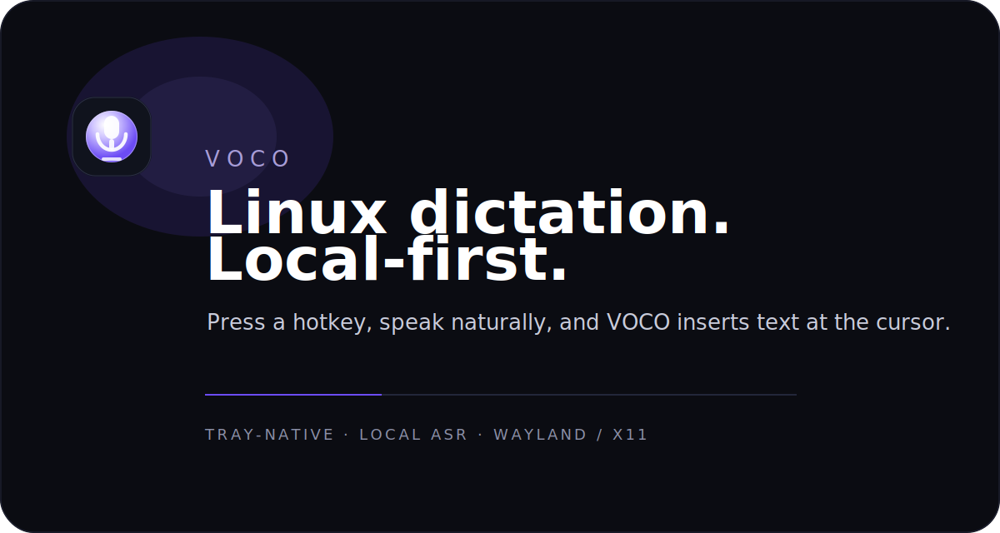

<!-- markdownlint-disable MD031 MD033 MD041 -->
<p align="center">
  
</p>

<p align="center">
  <strong>A voice-native interface layer designed for speed and precision.</strong><br>
  Press a hotkey, speak naturally, and VOCO turns speech into text directly at your cursor.
</p>
<!-- markdownlint-enable MD041 -->

<p align="center">
  <a href="#requirements"></a>
  <a href="https://github.com/sergiopesch/voco/actions/workflows/ci.yml"></a>
  <a href="LICENSE"></a>
</p>

---

VOCO is a Linux desktop dictation tool built for low friction and high trust. It lives in your tray, listens on demand, keeps audio local, and surfaces clear state while it works.

## Install

### GitHub Releases

```bash
bash <(curl -s https://raw.githubusercontent.com/sergiopesch/voco/master/install)
```

GitHub Releases now target:
- `.deb` for Debian / Ubuntu
- `.AppImage` for portable Linux installs when bundled by the release build
- checksums for verification

Current stable release: `voco.2026.0.3`

An initial Flatpak packaging baseline is also included in `packaging/flatpak/` for local validation and Flathub preparation.
For AppImage fallback packaging, the repo also includes `scripts/package-appimage.sh` to finalize an AppDir when Tauri stops before emitting the final `.AppImage` file.

### Build from source

```bash
git clone https://github.com/sergiopesch/voco.git
cd voco
./scripts/setup.sh --install
```

More install paths and uninstall guidance live in [docs/install.md](docs/install.md).

## How It Works

1. Launch `VOCO` from your app launcher or run `voco`.
2. Press `Alt+D` to start listening.
3. Press `Alt+D` again and VOCO types the transcript at your cursor.

The current build uses a tray icon plus a compact listening HUD so state remains visible without taking over the desktop.
VOCO also checks GitHub Releases in-app so manual installs can see when a newer stable or beta build is available.
First launch now guides users through a compact setup flow for microphone access, mic selection, hotkeys, and HUD preferences.

## Features

| Feature | Details |
| --- | --- |
| Local-first transcription | `whisper.cpp` runs on your machine |
| Global hotkey | Default `Alt+D`, changeable at install time or in config |
| Tray-native workflow | Clear idle, ready, listening, and blocked states |
| Guided onboarding | First-run setup for microphone, hotkey, and HUD behavior |
| Smart insertion | Types into the focused app with clipboard fallback |
| Linux-aware behavior | Works with Wayland and X11 with documented constraints |

## Requirements

| What | Why |
| --- | --- |
| Ubuntu / Debian | Primary tested distro family |
| PulseAudio or PipeWire | Microphone input |
| Wayland: `ydotool`, `wl-clipboard` | Text insertion and clipboard support |
| X11: `xdotool`, `xclip` | Text insertion and clipboard support |

Other Linux distributions may work, but the project currently validates Ubuntu-class environments first.

## Configuration

VOCO stores configuration at `~/.config/voco/config.json`.

```json
{
  "hotkey": "Alt+D",
  "insertionStrategy": "auto"
}
```

Existing `voice` installs are migrated automatically on startup:
- `~/.config/voice/config.json` -> `~/.config/voco/config.json`
- `~/.local/share/voice/models/` -> `~/.local/share/voco/models/`

Current product note:
- the voice-profile step is present in onboarding, but accent-aware recognition remains a future feature and is intentionally disabled in the current release

On Wayland, `Alt+D` and `Alt+Shift+D` remain the most reliable built-in presets because they can use the evdev backend.

## Development

```bash
git clone https://github.com/sergiopesch/voco.git
cd voco
./scripts/setup.sh
npm run dev
npm run check
npm run lint
npm test
cargo test --manifest-path apps/desktop/src-tauri/Cargo.toml
```

Optional tray diagnostics:

```bash
VOCO_TRAY_DEBUG=1 npm run dev
```

## Documentation

- [docs/install.md](docs/install.md)
- [docs/linux-packaging.md](docs/linux-packaging.md)
- [docs/store-listing.md](docs/store-listing.md)
- [docs/troubleshooting.md](docs/troubleshooting.md)
- [docs/contributing.md](docs/contributing.md)
- [docs/architecture/README.md](docs/architecture/README.md)

## Known Limitations

- Wayland text insertion still depends on compositor support and `ydotool`.
- Some Linux shells render tray icons monochrome, reducing the effect of accent colors.
- First launch downloads the speech model once before VOCO can run fully offline.
- The onboarding microphone meter is a setup aid, not a calibrated studio meter.

## License

MIT
